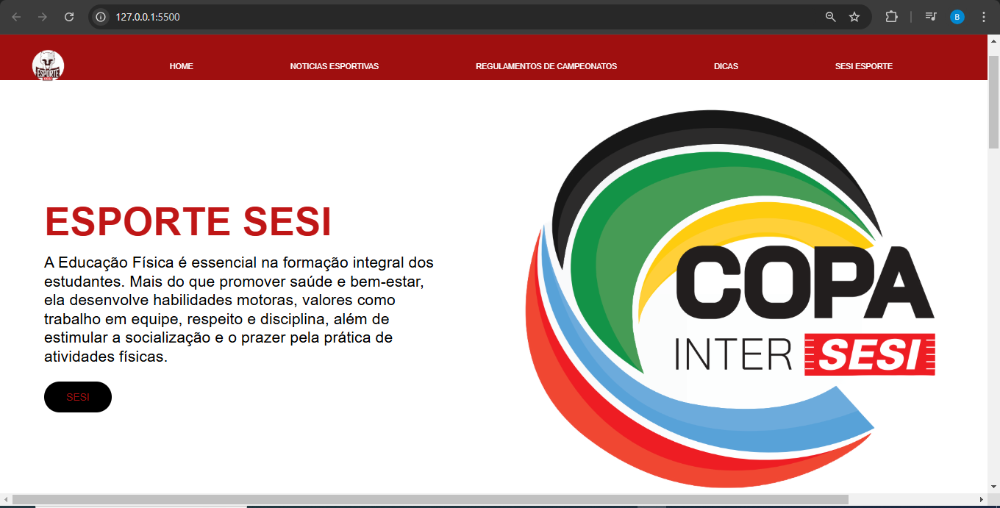

### Projeto Final Front-End: Arte

---

## Sobre 
Projeto final da disciplina de Front-End, elaborado com o objetivo de promover a disciplina escolar de Arte. Adicionalmente, o projeto visa aplicar, de forma prática, os conhecimentos adquiridos ao longo do curso Técnico em Desenvolvimento de Sistemas do [SENAI Jandira](https://sp.senai.br/unidade/jandira/).

---
## Tecnologias utilizadas
- HTML
- CSS
- MarkDown
- Git

---
## Autores

- [Lara Machado](https://github.com/lahoracio)
- [Beatriz Boletini](https://github.com/boletini)
